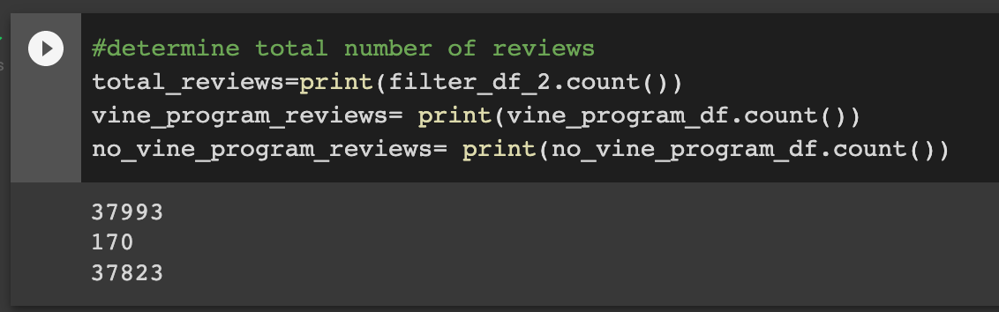
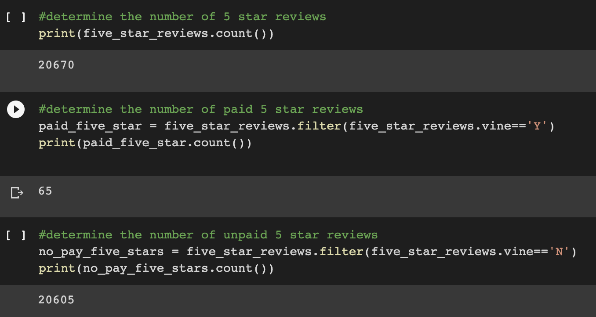

# Amazon Vine Analysis
## Overview of Analysis
* The purpose of this analysis was to access a large dataset of amazon reviews for a certain type of products, and determine if there was any bias towards favorable reviews. 
* To determine this, I looked into the dataset to see which reviews were written by Vine program members.
* The Amazon Vine Program is a program where Amazon pays members of the program to write reviews for different products.
* I used Pyspark to perform the ETL process on the dataset and connected it to an AWS RDS instance
* Then I loaded the transformed data into PgAdmin.
* Finally I used Pyspark to perform my final analysis
## Results
* After performing my analysis I found the following results:
  * There were 37,993 total reviews.
  * 170 of those reviews were part of the Vine Program, 37,823 were not part of the vine program.

 * Out of the 37,993 reviews, there were 20,670 five star reviews
 * 65 of the 5 star reviews were part of the paid Vine Program, 20,605 of the 5 star reviews were not part of the paid Vine Program
 
 * 38% of the reviews from the paid Vine program were 5 stars
 
